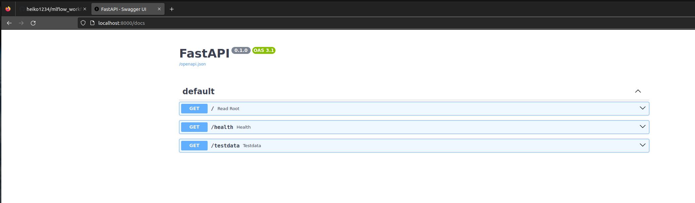

# mlflow_workflow_api


```dash

# (.venv) cd backend_service/
# (.venv) uvicorn main:app --reload


# use this command to run the backend service

(.venv) cd backend_service/backend_service/
(.venv) uvicorn main:app --reload


# http://localhost:8000/docs


```


# FastAPI





